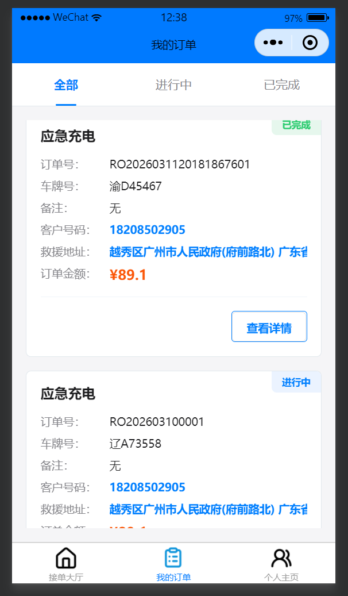
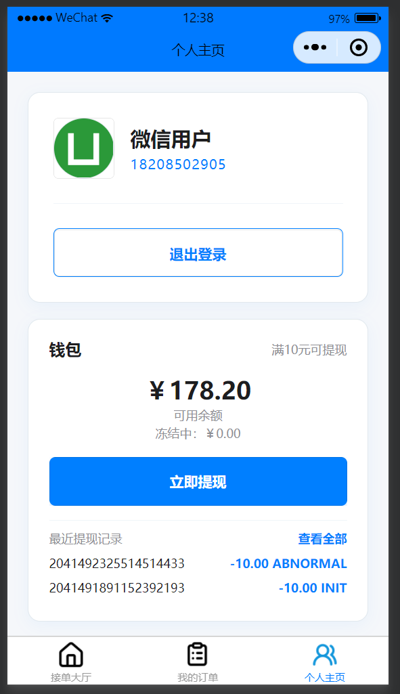
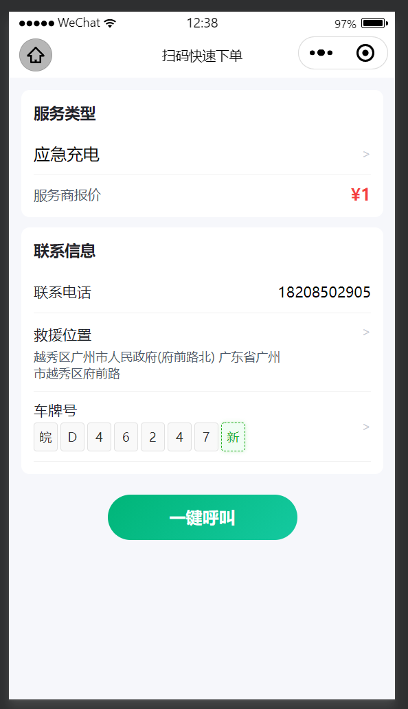
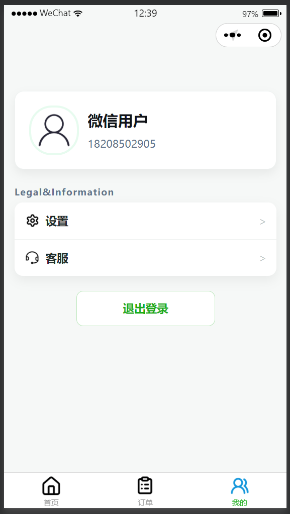
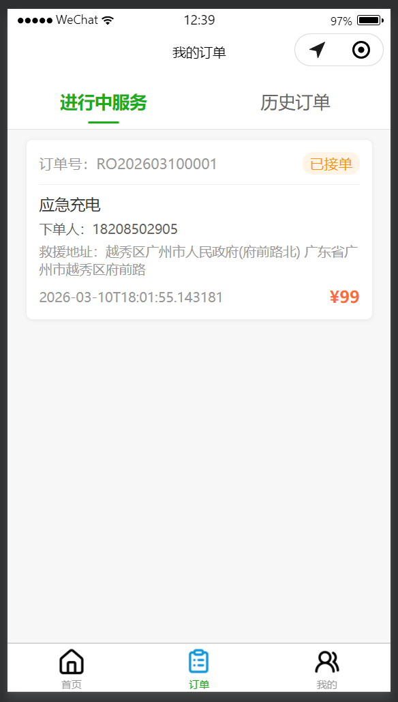
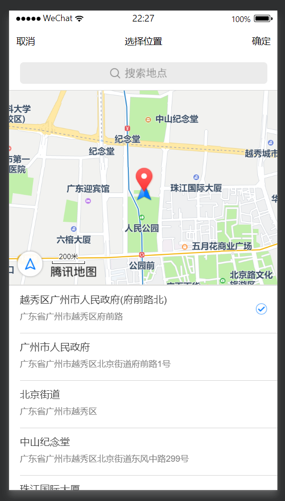
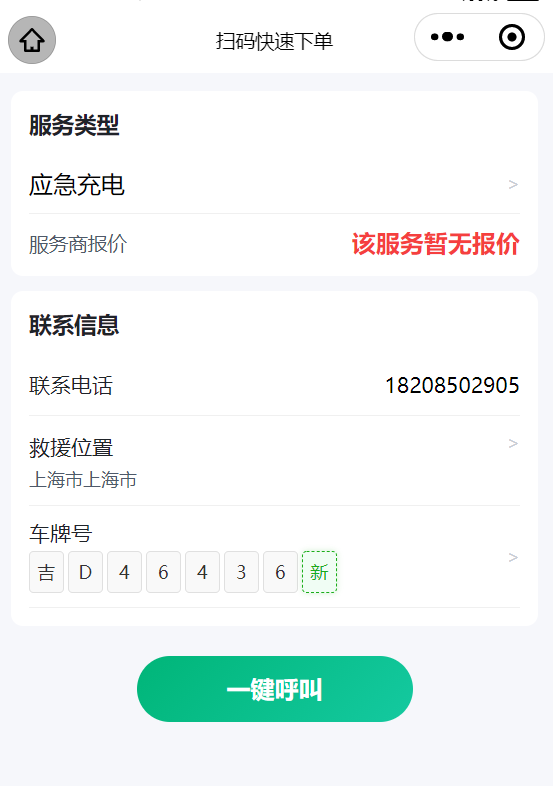
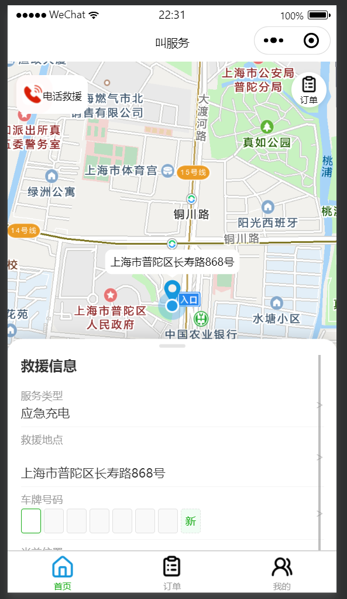

# rescue — 道路救援小程序与后端服务

## 项目简介
rescue 是一个道路救援类小程序项目，包含：
- 小程序前端（微信/小程序）
- 后端服务（Spring Boot）

本仓库包含源码、配置示例与开发脚本。相关页面截图位于本地文件夹 `挑战杯小程序截图/`（该文件夹已添加到 `.gitignore`，不应上传到远端仓库）。

## 快速上手

1. 克隆仓库：

```bash
git clone <repo-url>
```

2. 后端运行（示例）：

```bash
# 构建
mvn clean package
# 运行（使用环境变量或 .env）
java -jar rescue_api/target/*.jar
```

请参考 `rescue_api/.env.example` 填写本地 `rescue_api/.env`（`.env` 已被加入 `.gitignore`，不要提交真实密钥）。

## 截图

师傅端：




用户端：





其它：






## 安全说明
- 已将代码中明文凭证替换为环境变量占位，历史敏感项已在本地清理（`git-filter-repo`）。
- 在将清理后的历史推送到远端前，请确保已在第三方平台轮换/失效已泄露的密钥，以避免 GitHub Push Protection 拦截。

## 目录结构（简要）
- `道路救援/miniprogram/` — 小程序前端
- `E:\rescue\rescue_shifu` — 小程序前端
- `rescue_api/` — 后端服务（Spring Boot）

## 联系与贡献
如需贡献，请使用 Feature 分支并提交 PR；历史被重写时所有协作者需重新克隆仓库或重置本地分支：

```bash
git fetch origin
git reset --hard origin/main
```

